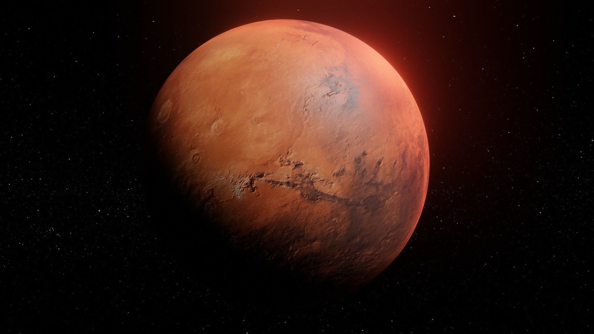

# Vida em Marte?

O objetivo deste trabalho é criar um modelo de visão computacional e tentar detectar locais em marte que possuem à probabilidade alta de ter existido vida Ex.(Lagos, Florestas, Rios)

Quer contribuir com o estudo?
Contato: mauriciogallojr1993@gmail.com